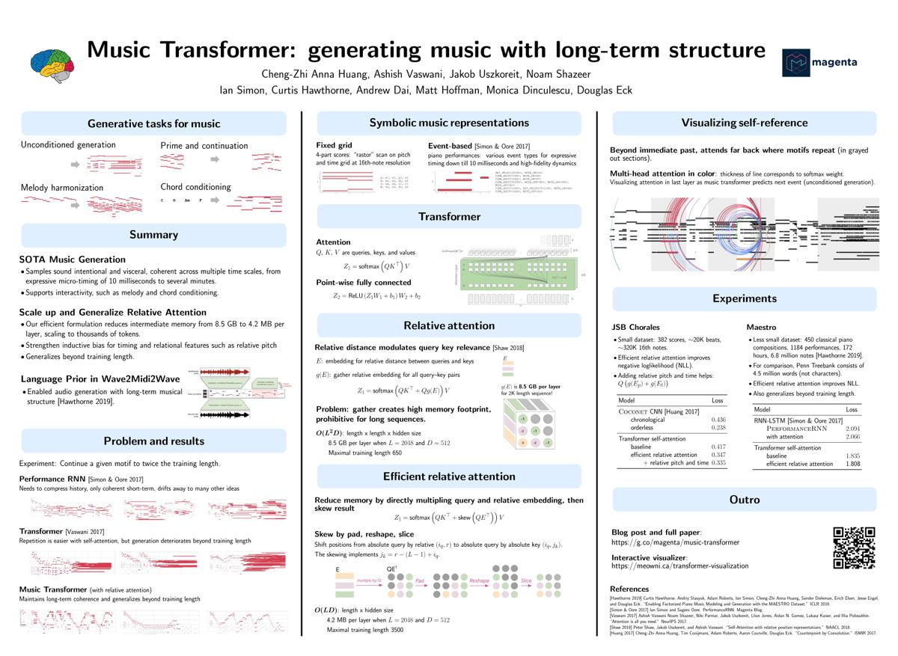

# Neural Network Architectures

This repository collects information and explanations of Neural Network Architectures which are used in Music Generation.

## Neural Network Architectures (original papers)

| NN Architecture | Year | Authors | Link to original paper |
| ------------- | ------------- | ------------- | ------------- |
| Long Short-Term Memory (LSTM) | 1997 | Sepp Hochreiter, Jürgen Schmidhuber | http://www.bioinf.jku.at/publications/older/2604.pdf |
| Variational Auto Encoder (VAE) | 2013 | Diederik P. Kingma, Max Welling | https://arxiv.org/pdf/1312.6114.pdf |
| Generative Adversarial Networks (GAN) | 2014 | Ian J. Goodfellow, Jean Pouget-Abadie, Mehdi Mirza, Bing Xu, David Warde-Farley, Sherjil Ozair, Aaron Courville, Yoshua Bengio | https://arxiv.org/pdf/1406.2661.pdf |

## Deep Learning Models for Music Generation

### 2020

### 2019

### 2018

* **MusicVAE (Magenta)**

Web page: https://magenta.tensorflow.org/music-vae

Link to paper: https://arxiv.org/pdf/1803.05428.pdf

Github (code): https://github.com/tensorflow/magenta/tree/master/magenta/models/music_vae

Articles of interest: https://medium.com/@musicvaeubcse/musicvae-understanding-of-the-googles-work-for-interpolating-two-music-sequences-621dcbfa307c

* **Music Transformer (Magenta)**

Web page: https://magenta.tensorflow.org/music-transformer

Link to paper: https://arxiv.org/pdf/1809.04281.pdf

Github (code): 

Articles of interest: 

### 2018

* **MuseGAN**

Web page: https://salu133445.github.io/musegan/

Link to paper: https://arxiv.org/pdf/1709.06298.pdf

Github (code): https://github.com/salu133445/musegan

## Author

**Carlos Hernández**: carloshero@unizar.es
