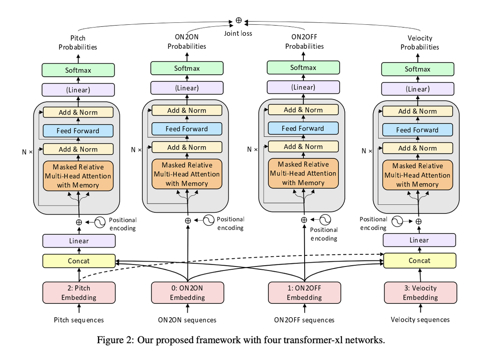
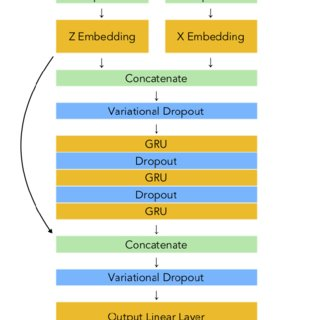
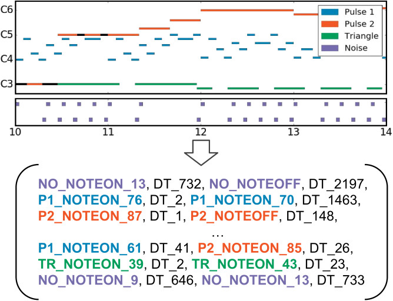
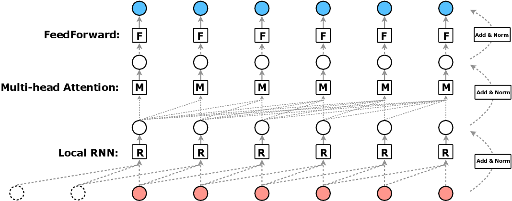
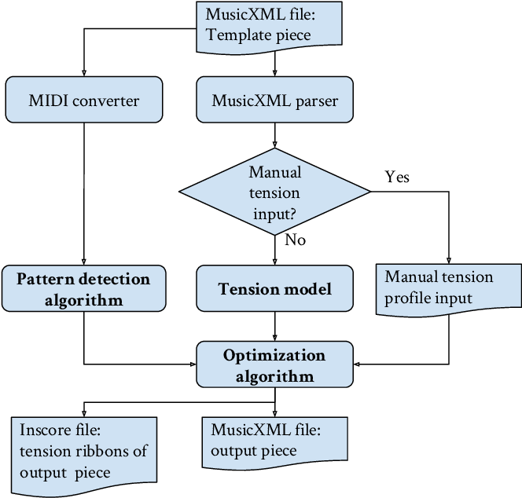
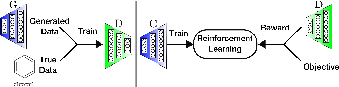
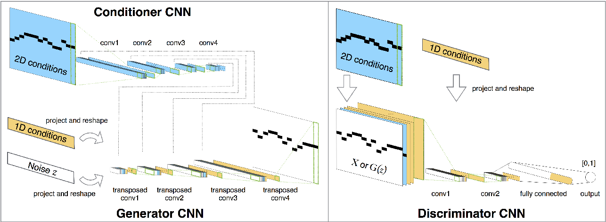
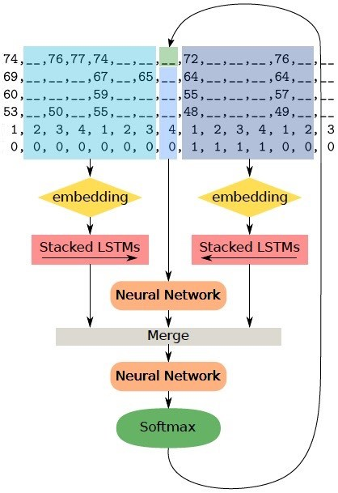
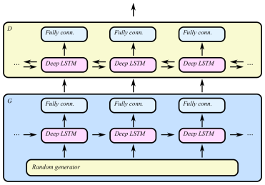

# DEEP LEARNING FOR MUSIC GENERATION

This file presents the State of the Art of Music Generation. Most of these references are used in the paper ["Music Composition with Deep Learning: A Review"](#https://arxiv.org/abs/2108.12290).

The [authors](#Author) of the paper want to thank Jürgen Schmidhuber for his suggestions.

Make a pull request if you want to contribute to this references list.

You can download a PDF version of this repo here: [README.pdf](AIMusicGeneration.pdf)

All the images belong to their corresponding authors.

## Table of Contents

1. [Algorithmic Composition](#algorithmic-composition)

    - [1992](#1992alg)

    - [Books](#books-alg)

2. [Neural Network Architectures](#neural-network-architectures)

3. [Deep Learning Models for Music Generation](#deep-learning-music-generation)

    - [2021](#2020deep)
    - [2020](#2020deep)
    - [2019](#2019deep)
    - [2018](#2018deep)
    - [2017](#2017deep)
    - [2016](#2016deep)
    - [2015](#2015deep)
    - [2002](#2002deep)
    - [1990s](#1990deep)

    - [Books and Reviews](#books-reviews-deep)
      - [Books](#books-deep)
      - [Reviews](#reviews-deep)

4. [Datasets](#datasets)

5. [Journals and Conferences](#journals)

6. [Authors](#authors)

7. [Research Groups and Labs](#labs)

8. [Apps for Music Generation with AI](#apps)

9. [Other Resources](#other-resources)

[Author](#author)

## 2. Algorithmic Composition

### 1992

#### HARMONET

Hild, H., Feulner, J., & Menzel, W. (1992). HARMONET: A neural net for harmonizing chorales in the style of JS Bach. In Advances in neural information processing systems (pp. 267-274). [Paper](https://proceedings.neurips.cc/paper/1991/file/a7aeed74714116f3b292a982238f83d2-Paper.pdf)

### Books

* Westergaard, P. (1959). Experimental Music. Composition with an Electronic Computer.

* Todd, P. M. (1989). A connectionist approach to algorithmic composition. Computer Music Journal, 13(4), 27-43.

* Cope, D. (2000). The algorithmic composer (Vol. 16). AR Editions, Inc..

* Nierhaus, G. (2009). Algorithmic composition: paradigms of automated music generation. Springer Science & Business Media.

* Müller, M. (2015). Fundamentals of music processing: Audio, analysis, algorithms, applications. Springer.

* McLean, A., & Dean, R. T. (Eds.). (2018). The Oxford handbook of algorithmic music. Oxford University Press.

## 2. Neural Network Architectures

| NN Architecture | Year | Authors | Link to original paper | Slides |
| ------------- | ------------- | ------------- | ------------- | ------------- |
| Long Short-Term Memory (LSTM) | 1997 | Sepp Hochreiter, Jürgen Schmidhuber | http://www.bioinf.jku.at/publications/older/2604.pdf | [LSTM.pdf](Slides/LSTM_v1.pdf) |
| Convolutional Neural Network (CNN) | 1998 | Yann LeCun, Léon Bottou, YoshuaBengio, Patrick Haffner | http://vision.stanford.edu/cs598_spring07/papers/Lecun98.pdf |  |
| Variational Auto Encoder (VAE) | 2013 | Diederik P. Kingma, Max Welling | https://arxiv.org/pdf/1312.6114.pdf |
| Generative Adversarial Networks (GAN) | 2014 | Ian J. Goodfellow, Jean Pouget-Abadie, Mehdi Mirza, Bing Xu, David Warde-Farley, Sherjil Ozair, Aaron Courville, Yoshua Bengio | https://arxiv.org/pdf/1406.2661.pdf |  | 
| Transformer | 2017 | Ashish Vaswani, Noam Shazeer, Niki Parmar, Jakob Uszkoreit, Llion Jones, Aidan N. Gomez, Łukasz Kaiser, Illia Polosukhin | https://arxiv.org/pdf/1706.03762.pdf | |

## 3. Deep Learning Models for Music Generation

### 2021

#### Melody Generation from Lyrics

Yu, Y., Srivastava, A., & Canales, S. (2021). Conditional lstm-gan for melody generation from lyrics. ACM Transactions on Multimedia Computing, Communications, and Applications (TOMM), 17(1), 1-20.

[Paper](https://dl.acm.org/doi/abs/10.1145/3424116)

#### Music Generation with Diffusion Models

Mittal, G., Engel, J., Hawthorne, C., & Simon, I. (2021). Symbolic music generation with diffusion models. arXiv preprint arXiv:2103.16091.

[Paper](https://arxiv.org/abs/2103.16091) [GitHub](https://github.com/magenta/symbolic-music-diffusion)

### 2020

#### Controllable Polyphonic Music Generation

Wang, Z., Wang, D., Zhang, Y., & Xia, G. (2020). Learning interpretable representation for controllable polyphonic music generation. arXiv preprint arXiv:2008.07122.

[Paper](https://arxiv.org/abs/2008.07122) [Web](https://program.ismir2020.net/poster_5-05.html) [Video](https://www.youtube.com/watch?v=Sb6jXP_7dtE&t=28s&ab_channel=ISMIR2020)

#### MMM: Multitrack Music Generation

Ens, J., & Pasquier, P. (2020). Mmm: Exploring conditional multi-track music generation with the transformer. arXiv preprint arXiv:2008.06048.

[Paper](https://arxiv.org/abs/2008.06048) [Web](https://jeffreyjohnens.github.io/MMM/) [Colab](https://colab.research.google.com/drive/1xGZW3GP24HUsxnbebqfy1iCyYySQ64Vs?usp=sharing) [Github (AI Guru)](https://github.com/AI-Guru/MMM-JSB)

#### Transformer-XL

Wu, X., Wang, C., & Lei, Q. (2020). Transformer-XL Based Music Generation with Multiple Sequences of Time-valued Notes. arXiv preprint arXiv:2007.07244.

[Paper](https://arxiv.org/abs/2007.07244)

#### Transformer VAE

Jiang, J., Xia, G. G., Carlton, D. B., Anderson, C. N., & Miyakawa, R. H. (2020, May). Transformer vae: A hierarchical model for structure-aware and interpretable music representation learning. In ICASSP 2020-2020 IEEE International Conference on Acoustics, Speech and Signal Processing (ICASSP) (pp. 516-520). IEEE.

[Paper](https://ieeexplore.ieee.org/document/9054554)

### 2019

#### TonicNet

Peracha, O. (2019). Improving polyphonic music models with feature-rich encoding. arXiv preprint arXiv:1911.11775.

[Paper](https://arxiv.org/abs/1911.11775)

#### LakhNES

Donahue, C., Mao, H. H., Li, Y. E., Cottrell, G. W., & McAuley, J. (2019). LakhNES: Improving multi-instrumental music generation with cross-domain pre-training. arXiv preprint arXiv:1907.04868.

[Paper](https://arxiv.org/abs/1907.04868)

#### R-Transformer

Wang, Z., Ma, Y., Liu, Z., & Tang, J. (2019). R-transformer: Recurrent neural network enhanced transformer. arXiv preprint arXiv:1907.05572.

[Paper](https://arxiv.org/abs/1907.05572)

#### MuseNet - OpenAI

[Web](https://openai.com/blog/musenet/)

#### Maia Music Generator

[Web](https://maia.music.blog/2019/05/13/maia-a-new-music-generator/)

#### Coconet: Counterpoint by Convolution

Huang, C. Z. A., Cooijmans, T., Roberts, A., Courville, A., & Eck, D. (2019). Counterpoint by convolution. arXiv preprint arXiv:1903.07227.

[Paper](https://arxiv.org/abs/1903.07227) [Web](https://coconets.github.io/)

### 2018

#### Music Transformer - Google Magenta

Huang, C. Z. A., Vaswani, A., Uszkoreit, J., Shazeer, N., Simon, I., Hawthorne, et al. (2018). Music transformer. arXiv preprint arXiv:1809.04281.

[Web](https://magenta.tensorflow.org/music-transformer) [Poster](Images/transformer_poster.jpg) [Paper](https://arxiv.org/pdf/1809.04281.pdf)

#### Imposing Higher-level Structure in Polyphonic Music

Lattner, S., Grachten, M., & Widmer, G. (2018). Imposing higher-level structure in polyphonic music generation using convolutional restricted boltzmann machines and constraints. Journal of Creative Music Systems, 2, 1-31.

[Paper](https://arxiv.org/pdf/1612.04742.pdf)

#### MusicVAE - Google Magenta

Roberts, A., Engel, J., Raffel, C., Hawthorne, C., & Eck, D. (2018, July). A hierarchical latent vector model for learning long-term structure in music. In International Conference on Machine Learning (pp. 4364-4373). PMLR.

[Web](https://magenta.tensorflow.org/music-vae) [Paper](https://arxiv.org/pdf/1803.05428.pdf) [Code](https://github.com/tensorflow/magenta/tree/master/magenta/models/music_vae) [Google Colab](https://colab.research.google.com/notebooks/magenta/music_vae/music_vae.ipynb) [Explanation](https://medium.com/@musicvaeubcse/musicvae-understanding-of-the-googles-work-for-interpolating-two-music-sequences-621dcbfa307c)

### 2017

#### MorpheuS

Herremans, D., & Chew, E. (2017). MorpheuS: generating structured music with constrained patterns and tension. IEEE Transactions on Affective Computing, 10(4), 510-523.

[Paper](https://arxiv.org/pdf/1812.04832.pdf)

#### Polyphonic GAN

Lee, S. G., Hwang, U., Min, S., & Yoon, S. (2017). Polyphonic music generation with sequence generative adversarial networks. arXiv preprint arXiv:1710.11418.

[Paper](https://arxiv.org/abs/1710.11418)

#### BachBot - Microsoft

Liang, F. T., Gotham, M., Johnson, M., & Shotton, J. (2017, October). Automatic Stylistic Composition of Bach Chorales with Deep LSTM. In ISMIR (pp. 449-456).

[Paper](https://www.microsoft.com/en-us/research/publication/automatic-stylistic-composition-of-bach-chorales-with-deep-lstm/) [Liang Master Thesis 2016](https://www.mlmi.eng.cam.ac.uk/files/feynman_liang_8224771_assignsubmission_file_liangfeynmanthesis.pdf)

#### MuseGAN

Dong, H. W., Hsiao, W. Y., Yang, L. C., & Yang, Y. H. (2018, April). Musegan: Multi-track sequential generative adversarial networks for symbolic music generation and accompaniment. In Proceedings of the AAAI Conference on Artificial Intelligence (Vol. 32, No. 1).

[Web](https://salu133445.github.io/musegan/) [Paper](https://arxiv.org/pdf/1709.06298.pdf) [Poster](Images/musegan_ismir2017.jpg) [GitHub](https://github.com/salu133445/musegan)

#### Composing Music with LSTM

Johnson, D. D. (2017, April). Generating polyphonic music using tied parallel networks. In International conference on evolutionary and biologically inspired music and art (pp. 128-143). Springer, Cham.

[Paper](https://link.springer.com/chapter/10.1007/978-3-319-55750-2_9) [Web](https://www.danieldjohnson.com/2015/08/03/composing-music-with-recurrent-neural-networks/) [GitHub](https://github.com/danieldjohnson/biaxial-rnn-music-composition) [Blog](https://www.danieldjohnson.com/2015/08/03/composing-music-with-recurrent-neural-networks/)

#### ORGAN

Guimaraes, G. L., Sanchez-Lengeling, B., Outeiral, C., Farias, P. L. C., & Aspuru-Guzik, A. (2017). Objective-reinforced generative adversarial networks (ORGAN) for sequence generation models. arXiv preprint arXiv:1705.10843.

[Paper](https://arxiv.org/abs/1705.10843)

#### MidiNet

Yang, L. C., Chou, S. Y., & Yang, Y. H. (2017). MidiNet: A convolutional generative adversarial network for symbolic-domain music generation. arXiv preprint arXiv:1703.10847.

[Paper](https://arxiv.org/abs/1703.10847)

### 2016

#### DeepBach

Hadjeres, G., Pachet, F., & Nielsen, F. (2017, July). Deepbach: a steerable model for bach chorales generation. In International Conference on Machine Learning (pp. 1362-1371). PMLR.

[Web](http://www.flow-machines.com/history/projects/deepbach-polyphonic-music-generation-bach-chorales/) [Paper](https://arxiv.org/pdf/1612.01010.pdf) [Code](https://github.com/Ghadjeres/DeepBach)

#### Fine-Tuning with RL

Jaques, N., Gu, S., Turner, R. E., & Eck, D. (2016). Generating music by fine-tuning recurrent neural networks with reinforcement learning.

[Paper](https://research.google/pubs/pub45871/)

#### C-RNN-GAN

Mogren, O. (2016). C-RNN-GAN: Continuous recurrent neural networks with adversarial training. arXiv preprint arXiv:1611.09904.

[Paper](https://arxiv.org/abs/1611.09904)

#### SeqGAN

Yu, L., Zhang, W., Wang, J., & Yu, Y. (2017, February). Seqgan: Sequence generative adversarial nets with policy gradient. In Proceedings of the AAAI conference on artificial intelligence (Vol. 31, No. 1).

[Paper](https://arxiv.org/abs/1609.05473)

### 2002

#### Temporal Structure in Music

Eck, D., & Schmidhuber, J. (2002, September). Finding temporal structure in music: Blues improvisation with LSTM recurrent networks. In Proceedings of the 12th IEEE workshop on neural networks for signal processing (pp. 747-756). IEEE.

[Paper](https://ieeexplore.ieee.org/document/1030094)

### 1980s - 1990s

Mozer, M. C. (1994). Neural network music composition by prediction: Exploring the benefits of psychoacoustic constraints and multi-scale processing. Connection Science, 6(2-3), 247-280.

[Paper](https://www.tandfonline.com/doi/abs/10.1080/09540099408915726)

### Books and Reviews

### Books

* Briot, J. P., Hadjeres, G., & Pachet, F. (2020). Deep learning techniques for music generation (pp. 1-249). Springer.

### Reviews

* Ji, S., Luo, J., & Yang, X. (2020). A Comprehensive Survey on Deep Music Generation: Multi-level Representations, Algorithms, Evaluations, and Future Directions. arXiv preprint arXiv:2011.06801.
[Paper](https://arxiv.org/abs/2011.06801)

* Briot, J. P., Hadjeres, G., & Pachet, F. D. (2017). Deep learning techniques for music generation--a survey. arXiv preprint arXiv:1709.01620.
[Paper](https://arxiv.org/abs/1709.01620)

## 4. Datasets

* The Lakh MIDI Dataset v0.1 [Web](https://colinraffel.com/projects/lmd/) [Tutorial IPython](https://nbviewer.jupyter.org/github/craffel/midi-dataset/blob/master/Tutorial.ipynb)

## 5. Journals and Conferences

* International Society for Music Information Retrieval (ISMIR) [Web](https://www.ismir.net/)

* IEEE Signal Processing (ICASSP) [Web](https://signalprocessingsociety.org/publications-resources)

* ELSEVIER Signal Processing Journal [Web](https://www.journals.elsevier.com/signal-processing)

* Association for the Advancement of Artificial Intelligence (AAAI) [Web](https://www.aaai.org/)

* Journal of Artificial Intelligence Research (JAIR) [Web](https://www.jair.org/index.php/jair)

* International Joint Conferences on Artificial Intelligence (IJCAI) [Web](https://www.ijcai.org/)

* International Conference on Learning Representations (ICLR) [Web](https://iclr.cc)

* IET Signal Processing Journal [Web](https://digital-library.theiet.org/content/journals/iet-spr)

* Journal of New Music Research (JNMR) [Web](https://www.tandfonline.com/loi/nnmr20)

* Audio Engineering Society - Conference on Semantic Audio (AES) [Web](http://www.aes.org/)

* International Conference on Digital Audio Effects (DAFx) [Web](http://dafx.de/)

## 6. Authors

* David Cope [Web](http://artsites.ucsc.edu/faculty/cope/)

* Colin Raffel [Web](https://colinraffel.com/)

* Jesse Engel [Web](https://jesseengel.github.io/)

* Douglas Eck [Web](http://www.iro.umontreal.ca/~eckdoug/)

* François Pachet [Web](https://www.francoispachet.fr/)

## 7. Research Groups and Labs

* Audiolabs Erlangen [Web](https://www.audiolabs-erlangen.de/)

* Music Informatics Group [Web](https://musicinformatics.gatech.edu/)

* Music and Artificial Intelligence Lab [Web](https://musicai.citi.sinica.edu.tw/)

## 8. Apps for Music Generation with AI

* AIVA (paid) [Web](https://www.aiva.ai/)

* Amper Music (paid) [Web](https://www.ampermusic.com/)

* Ecrett Music (paid) [Web](https://ecrettmusic.com/)

* Humtap (free, iOS) [Web](https://www.humtap.com/)

* Amadeus Code (free/paid, iOS) [Web](https://amadeuscode.com/top)

* Computoser (free) [Web](computoser.com)

* Brain.fm (paid) [Web](https://www.brain.fm/login?next=/app/player)

## 9. Other Resources

* Bustena (web in spanish to learn harmony theory) [Web](http://www.bustena.com/curso-de-armonia-i/)

## Author

[**Carlos Hernández-Oliván**](https://carlosholivan.github.io/index.html): carloshero@unizar.es

José Ramón Beltrán Blázquez
