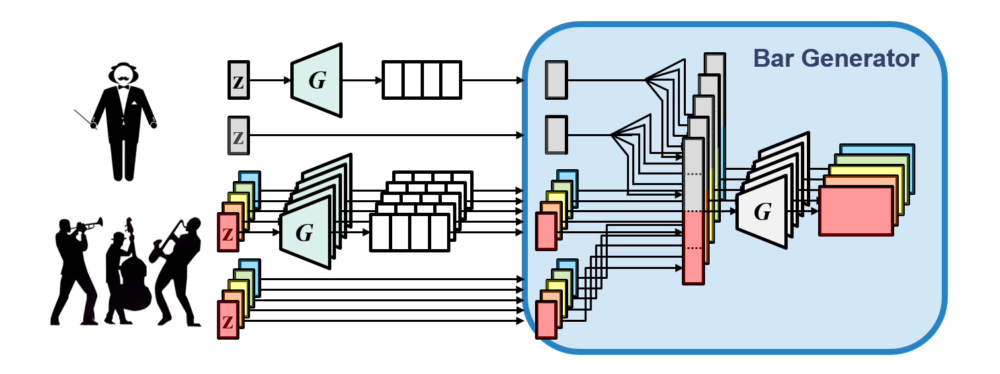

# DEEP LEARNING FOR MUSIC GENERATION

This repository collects information and explanations of Neural Network Architectures which are used in Music Generation.

## Table of Contents

- [Neural Network Architectures](#neural-network-architectures)
- [Deep Learning Models for Music Generation](#deep-learning-models-for-music-generation)
  - [2020](#2020deep)
  - [2019](#2019deep)
    - [MuseNet](#musenet)
  - [2018](#2018deep)
    - [MusicVAE (Magenta)](#musicvae-magenta)
    - [Music Transformer (Magenta)](#music-transformer-magenta)
  - [2017](#2017deep)
    - [MuseGAN](#musegan)
- [Articles (per year of submission)](#articles)
  - [2020](#2020articles)
  - [2019](#2019articles)
  - [2018](#2018articles)
  - [2017](#2017articles)
  - [2017](#2017articles)
- [Datasets](#datasets)
- [Research Groups and Labs](#research-groups-and-labs)
- [Author](#author)

## Neural Network Architectures

| NN Architecture | Year | Authors | Link to original paper | Slides |
| ------------- | ------------- | ------------- | ------------- | ------------- |
| Long Short-Term Memory (LSTM) | 1997 | Sepp Hochreiter, Jürgen Schmidhuber | http://www.bioinf.jku.at/publications/older/2604.pdf | [LSTM.pdf](Slides/LSTM_v1.pdf) |
| Convolutional Neural Network (CNN) | 1998 | Yann LeCun, Léon Bottou, YoshuaBengio, Patrick Haffner | http://vision.stanford.edu/cs598_spring07/papers/Lecun98.pdf |  |
| Variational Auto Encoder (VAE) | 2013 | Diederik P. Kingma, Max Welling | https://arxiv.org/pdf/1312.6114.pdf |
| Generative Adversarial Networks (GAN) | 2014 | Ian J. Goodfellow, Jean Pouget-Abadie, Mehdi Mirza, Bing Xu, David Warde-Farley, Sherjil Ozair, Aaron Courville, Yoshua Bengio | https://arxiv.org/pdf/1406.2661.pdf |  | 
| Transformer | 2017 | Ashish Vaswani, Noam Shazeer, Niki Parmar, Jakob Uszkoreit, Llion Jones, Aidan N. Gomez, Łukasz Kaiser, Illia Polosukhin | https://arxiv.org/pdf/1706.03762.pdf | |

## Deep Learning Models for Music Generation

### 2020

### 2019

#### MuseNet

Web page: https://openai.com/blog/musenet/

### 2018

#### MusicVAE (Magenta)

[[Web]](https://magenta.tensorflow.org/music-vae) [[Paper]](https://arxiv.org/pdf/1803.05428.pdf) [[Code]](https://github.com/tensorflow/magenta/tree/master/magenta/models/music_vae)

Articles of interest: 
* https://medium.com/@musicvaeubcse/musicvae-understanding-of-the-googles-work-for-interpolating-two-music-sequences-621dcbfa307c

#### Music Transformer (Magenta)

[[Web]](https://magenta.tensorflow.org/music-transformer) [[Poster]](Images/transformer_poster.jpg) [[Paper]](https://arxiv.org/pdf/1809.04281.pdf)

Articles of interest: 

### 2017

#### MuseGAN

[[Web]](https://salu133445.github.io/musegan/) [[Paper]](https://arxiv.org/pdf/1709.06298.pdf) [[Poster]](Images/musegan_ismir2017.jpg) [[Code]](https://github.com/salu133445/musegan)

## Articles (per year of submission)

### 2020

### 2019

* Conditional LSTM-GAN for Melody Generation from Lyrics [[Paper]](https://arxiv.org/pdf/1908.05551.pdf)

### 2018 

* MorpheuS: generating structured music with constrained patterns and tension [[Paper]](https://arxiv.org/pdf/1812.04832.pdf)

### 2017 

### 2016

Imposing higher-level Structure in Polyphonic Music Generation using Convolutional Restricted Boltzmann Machines and Constraints [[Paper]](https://arxiv.org/pdf/1612.04742.pdf)

## Datasets

## Research Groups and Labs

## Author

**Carlos Hernández**: carloshero@unizar.es
