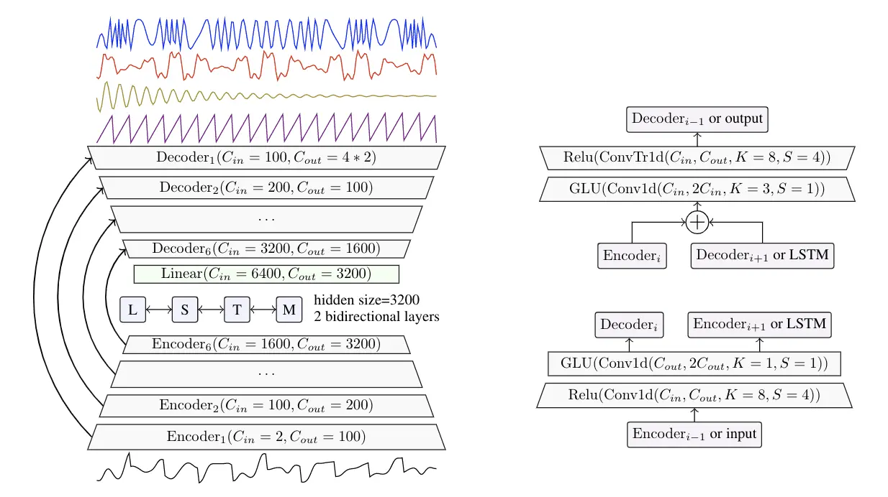
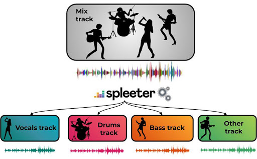
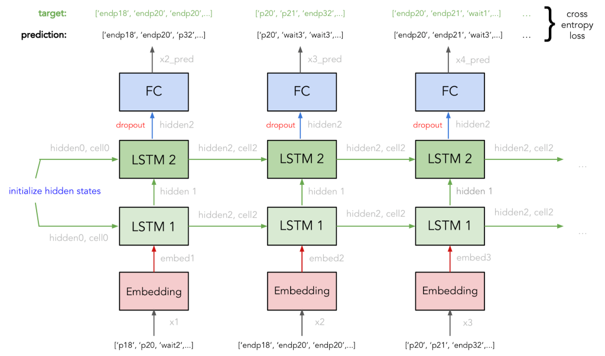

# DEEP LEARNING FOR MUSIC GENERATION

This repository collects information and explanations of Neural Network Architectures which are used in Music Generation.

## Table of Contents

- [Neural Network Architectures](#neural-network-architectures)
- [Souces Separation](#sources-separation)
  - [Demucs by Facebook](#demucs-by-facebook)
  - [Spleeter by Deezer](#spleeter-by-deezer)
- [Deep Learning Models for Music Generation](#deep-learning-models-for-music-generation)
  - [2020](#2020deep)
  - [2019](#2019deep)
    - [MuseNet](#musenet)
    - [Maia Music Generator](#maia-music-generator)
  - [2018](#2018deep)
    - [MusicVAE (Magenta)](#musicvae-magenta)
    - [Music Transformer (Magenta)](#music-transformer-magenta)
  - [2017](#2017deep)
    - [MuseGAN](#musegan)
  - [2016](#2016deep)
    - [DeepBach](#deepbach)
  - [2015](#2015deep)
    - [Composing Music with Recurrent Neural Networks](#composing-music-with-recurrent-neural-networks)
- [Articles (per year of submission)](#articles)
  - [2020](#2020articles)
  - [2019](#2019articles)
  - [2018](#2018articles)
  - [2017](#2017articles)
  - [2016](#2016articles)
- [Datasets](#datasets)
- [Journals and Conferences](#journals-and-conferences)
- [Research Groups and Labs](#research-groups-and-labs)
- [Books and References](#books-and-references)
- [Other Apps for Music Generation with AI](#other-apps-for-music-generation-with-ai)
- [Other Resources](#other-resources)
- [Author](#author)

## Neural Network Architectures

| NN Architecture | Year | Authors | Link to original paper | Slides |
| ------------- | ------------- | ------------- | ------------- | ------------- |
| Long Short-Term Memory (LSTM) | 1997 | Sepp Hochreiter, Jürgen Schmidhuber | http://www.bioinf.jku.at/publications/older/2604.pdf | [LSTM.pdf](Slides/LSTM_v1.pdf) |
| Convolutional Neural Network (CNN) | 1998 | Yann LeCun, Léon Bottou, YoshuaBengio, Patrick Haffner | http://vision.stanford.edu/cs598_spring07/papers/Lecun98.pdf |  |
| Variational Auto Encoder (VAE) | 2013 | Diederik P. Kingma, Max Welling | https://arxiv.org/pdf/1312.6114.pdf |
| Generative Adversarial Networks (GAN) | 2014 | Ian J. Goodfellow, Jean Pouget-Abadie, Mehdi Mirza, Bing Xu, David Warde-Farley, Sherjil Ozair, Aaron Courville, Yoshua Bengio | https://arxiv.org/pdf/1406.2661.pdf |  | 
| Transformer | 2017 | Ashish Vaswani, Noam Shazeer, Niki Parmar, Jakob Uszkoreit, Llion Jones, Aidan N. Gomez, Łukasz Kaiser, Illia Polosukhin | https://arxiv.org/pdf/1706.03762.pdf | |

## Sources Separation

* Google Colab Notebook with Demucs vs Spleeter comparison: 

### Demucs by Facebook

[[Web and Code]](https://github.com/facebookresearch/demucs) [[Paper]](https://hal.archives-ouvertes.fr/hal-02379796/document)

### Spleeter by Deezer

Pre-trained models:
* Vocals (singing voice) / accompaniment separation (2 stems)
* Vocals / drums / bass / other separation (4 stems)
* Vocals / drums / bass / piano / other separation (5 stems)

Papers: 

* Andreas Jansson, Eric J. Humphrey, Nicola Montecchio, Rachel Bittner, Aparna Kumar, and Tillman Weyde. Singingvoice  separation  with  deep  u-net  convolutional  networks.  InProceedings of the International Society for MusicInformation Retrieval Conference (ISMIR), pages 323–332, 2017. [[Link]](https://openaccess.city.ac.uk/id/eprint/19289/1/)

Other references to see: 

* MIMILAKIS, Stylianos I.; DROSSOS, Konstantinos; SCHULLER, Gerald. Unsupervised Interpretable Representation Learning for Singing Voice Separation. arXiv preprint arXiv:2003.01567, 2020. [[Link]](https://arxiv.org/pdf/2003.01567.pdf)

[[Web and Code]](https://github.com/deezer/spleeter) [[Paper]](http://archives.ismir.net/ismir2019/latebreaking/000036.pdf) 

## Deep Learning Models for Music Generation

### 2020

### 2019

#### MuseNet

Web page: https://openai.com/blog/musenet/

#### Maia Music Generator

[[Web]](https://maia.music.blog/2019/05/13/maia-a-new-music-generator/)

### 2018

#### MusicVAE (Magenta)

[[Web]](https://magenta.tensorflow.org/music-vae) [[Paper]](https://arxiv.org/pdf/1803.05428.pdf) [[Code]](https://github.com/tensorflow/magenta/tree/master/magenta/models/music_vae) [[Google Colab]](https://colab.research.google.com/notebooks/magenta/music_vae/music_vae.ipynb)

Articles of interest: 
* MusicVAE: Understanding of the googles work for interpolating two music sequences [[Web]](https://medium.com/@musicvaeubcse/musicvae-understanding-of-the-googles-work-for-interpolating-two-music-sequences-621dcbfa307c)

#### Music Transformer (Magenta)

[[Web]](https://magenta.tensorflow.org/music-transformer) [[Poster]](Images/transformer_poster.jpg) [[Paper]](https://arxiv.org/pdf/1809.04281.pdf)

Articles of interest: 

### 2017

#### MuseGAN

[[Web]](https://salu133445.github.io/musegan/) [[Paper]](https://arxiv.org/pdf/1709.06298.pdf) [[Poster]](Images/musegan_ismir2017.jpg) [[Code]](https://github.com/salu133445/musegan)

### 2016

#### DeepBach

[[Web]](http://www.flow-machines.com/history/projects/deepbach-polyphonic-music-generation-bach-chorales/) [[Paper]](https://arxiv.org/pdf/1612.01010.pdf) [[Code]](https://github.com/Ghadjeres/DeepBach)

### 2015

#### Composing Music with Recurrent Neural Networks

[[Web]](http://www.hexahedria.com/2015/08/03/composing-music-with-recurrent-neural-networks/)

## Articles (per year of submission)

### 2020

### 2019

* Conditional LSTM-GAN for Melody Generation from Lyrics [[Paper]](https://arxiv.org/pdf/1908.05551.pdf)

### 2018 

* MorpheuS: generating structured music with constrained patterns and tension [[Paper]](https://arxiv.org/pdf/1812.04832.pdf)

* Music Transformer [[Paper]](https://arxiv.org/pdf/1809.04281.pdf)

### 2017 

* MuseGAN: Multi-track Sequential Generative Adversarial Networks for Symbolic Music Generation and Accompaniment [[Paper]](https://arxiv.org/pdf/1709.06298.pdf)

* Generating Polyphonic Music Using Tied Parallel Networks [[Paper]](http://www.hexahedria.com/files/2017generatingpolyphonic.pdf)

### 2016

* DeepBach: a Steerable Model for Bach Chorales Generation [[Paper]](https://arxiv.org/pdf/1612.01010.pdf)

* Imposing higher-level Structure in Polyphonic Music Generation using Convolutional Restricted Boltzmann Machines and Constraints [[Paper]](https://arxiv.org/pdf/1612.04742.pdf)

## Datasets

* The Lakh MIDI Dataset v0.1 [[Web]](https://colinraffel.com/projects/lmd/) [[Tutorial IPython]](https://nbviewer.jupyter.org/github/craffel/midi-dataset/blob/master/Tutorial.ipynb)

## Journals and Conferences

* International Society for Music Information Retrieval (ISMIR) [[Web]](https://www.ismir.net/)

* IEEE Signal Processing (ICASSP) [[Web]](https://signalprocessingsociety.org/publications-resources)

* ELSEVIER Signal Processing Journal [[Web]](https://www.journals.elsevier.com/signal-processing)

* Association for the Advancement of Artificial Intelligence (AAAI) [[Web]](https://www.aaai.org/)

* Journal of Artificial Intelligence Research (JAIR) [[Web]](https://www.jair.org/index.php/jair)

* International Joint Conferences on Artificial Intelligence (IJCAI) [[Web]](https://www.ijcai.org/)

* International Conference on Learning Representations (ICLR) [[Web]](https://iclr.cc)

* IET Signal Processing Journal [[Web]](https://digital-library.theiet.org/content/journals/iet-spr)

* Journal of New Music Research (JNMR) [[Web]](https://www.tandfonline.com/loi/nnmr20)

* Audio Engineering Society - Conference on Semantic Audio (AES) [[Web]](http://www.aes.org/)

* International Conference on Digital Audio Effects (DAFx) [[Web]]http://dafx.de/)

## Research Groups and Labs

* Audiolabs Erlangen [[Web]](https://www.audiolabs-erlangen.de/)

* Colin Raffel [[Web]](https://colinraffel.com/)

* François Pachet [[Web]](https://www.francoispachet.fr/)

* Music Informatics Group [[Web]](https://musicinformatics.gatech.edu/)

* Music and Artificial Intelligence Lab [[Web]](https://musicai.citi.sinica.edu.tw/)

## Books and References

* MÜLLER, Meinard. Fundamentals of music processing: Audio, analysis, algorithms, applications. Springer, 2015.

## Other Apps for Music Generation with AI

* AIVA (paid) [[Web]](https://www.aiva.ai/)

* Amper Music (paid) [[Web]](https://www.ampermusic.com/)

* Ecrett Music (paid) [[Web]](https://ecrettmusic.com/)

* Humtap (free, iOS) [[Web]](https://www.humtap.com/)

* Amadeus Code (free/paid, iOS) [[Web]](https://amadeuscode.com/top)

* Computoser (free) [[Web]](computoser.com)

* Brain.fm (paid) [[Web]](https://www.brain.fm/login?next=/app/player)

## Other Resources

* Bustena (web in spanish to learn harmony theory) [[Web]](http://www.bustena.com/curso-de-armonia-i/)

## Author

**Carlos Hernández**: carloshero@unizar.es
